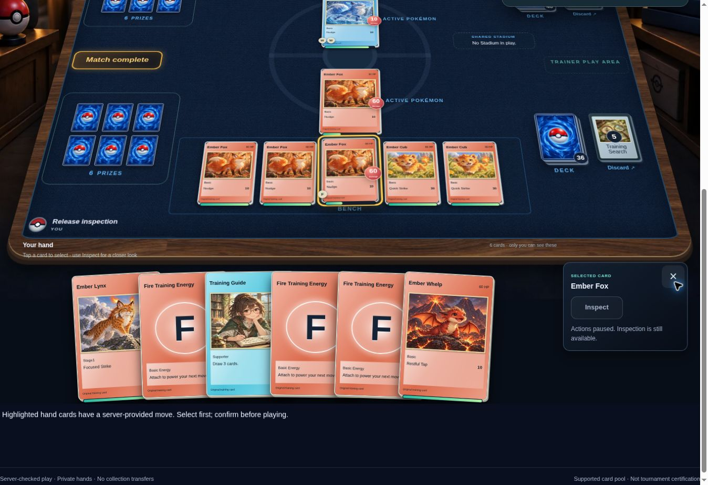

# Production readiness follow-up — CardShelf 0.52.1

Updated 9 October 2026 (Australia/Perth). Baseline: merged main
`a6eaa5a2b3abfeb0120082ca05da11dfad7586e7`; changes:
`fix/smtp-tls-image-tests`. The live application was rechecked through its
signed-in Data & settings and Release readiness pages and is now **0.51.0**.
This source change does not install 0.52.1 or configure an external mailbox.

## Current change and release boundary

The Postal/SMTP functionality from PR #66 is merged. The 0.52.1 follow-up
installs OpenSSL in the Docker build stage so real SMTP/TLS protocol tests can
generate disposable certificates in both native release-image builds. The
application, PostgreSQL and browser gates passed on 0.52.0; both native builds
identified this missing test prerequisite. The complete gates are required again
for the follow-up revision.

Postal API and authenticated external SMTP now share recovery and notification
flows. The WPMU DEV Basic Email preset supplies its verified host/port, requires
STARTTLS and caps the application's shared submission pace at 10 per minute.
Credentials are separately encrypted, bound to the SMTP connection identity,
never returned to clients and preserved when selecting the other provider.

The inspection found that interrupted mail could previously be automatically
resent despite possible provider acceptance. Both queues now distinguish known
rejection from uncertain submission. Migration 031 holds historical sending and
previously attempted unaccepted retry jobs, retaining accepted/delivered history.
Uncertain mail cannot be automatically or manually retried through the ordinary
notification action. Potentially accepted reset links retain normal validity.

Connection verification sends no message, checks the saved revision and records
only safe evidence. SMTP readiness does not require Postal signatures and does
not treat SMTP acceptance or old Postal deliveries as inbox delivery. Sender DNS
checks, setup guidance, privacy disclosures and restoration behavior now account
for the selected provider. Restore clears old SMTP connection evidence while
retaining encrypted credentials and delivery history.

**Full public-launch acceptance and full feature parity remain incomplete.**
This release removes Postal as a mandatory dependency for application mail and
fixes retry safety; it cannot certify a WPMU mailbox that has not been provisioned
and configured. Account verification, offline editing and full Pokémon rules
coverage remain outside the implemented scope in [PARITY_CHECKLIST.md](PARITY_CHECKLIST.md).

## Executed local validation

| Check | Result / boundary |
|---|---|
| Unit and component suite | 2,126 passed, zero failed or skipped. Includes both Arena engines and the added email security/protocol coverage. |
| Actual SMTP/TLS sockets | STARTTLS and implicit TLS login without sending, sender submission, invalid certificates/hostnames, missing encryption, rejected authentication and dropped DATA acknowledgment tested against disposable local servers using real Nodemailer. No external mailbox contacted. |
| Typecheck and production build | Passed. The existing nonfatal vue-router Volar plugin notice remains; no compiler/type failure. |
| Root production dependency audit | Zero known vulnerabilities. |
| Generated server audit | All 52 exact dependencies, including native platforms, audited separately; zero known vulnerabilities. |
| Full build dependency audit | Zero critical issues; the previously documented 11 high development-tool entries remain outside the generated server. See the historical audit boundary below. |
| Live recheck | Installed 0.51.0; 30 migrations applied; general worker, Live billing configuration/reconciliation, scanning configuration/budget, catalogue, Arena enablement, persisted push identity and advertising configuration show passing saved-evidence checks. No payment or email was sent. |

The PR's required CI also runs real PostgreSQL/HTTP recovery and provider tests,
including a private-schema pre-031 upgrade with preserved Postal secrets and
held old attempts. It exercises shared SMTP pacing and fair progress for both
queues under competing backlogs, actual recovery redemption,
late signed Postal events after a switch, secret-free endpoints and concurrent
verification changes. Desktop/phone browser coverage saves/reloads WPMU settings
through real APIs without revealing its synthetic password. Native AMD64/ARM64
image, migration, backup and upgrade checks remain required. Read the PR's current
checks for the exact commit result; this report is not a replacement for CI.

## Remaining live acceptance

| Area | Required next action |
|---|---|
| Selected mail provider | Upgrade to 0.52.1 and configure Postal or an eligible WPMU/custom SMTP account. Verify the connection, receive a test and recovery message, inspect sender signing and redeem the reset. Use signed delivery events for Postal; use inbox/provider reports for SMTP. |
| Public registration | Still closed on the inspected 0.51.0 deployment. Open only through the existing administrator flow after intended launch acceptance; preserve protected tester grants. |
| Live billing | Configuration and recent recorded evidence pass. A fresh purchase, correct entitlement, portal cancellation/renewal acceptance remains separate; no charge was initiated by this inspection. |
| Physical devices | iPhone/Android installation, opted-in push and actual camera acceptance remain required. Browser emulation is not physical-device evidence. |
| Arena | The 0.51.0 fix is deployed and its automated regressions are retained. Complete two eligible seats, reconnect and tournament advancement on the deployed version. The engine still supports a bounded effect/card pool. |
| Restoration | Restore a current production-data backup into an isolated installation. Code/image rehearsals do not prove recovery of the actual production dataset. |
| Advertising | Verify real guest/Free creative fill and consent, with paid/private exclusions, on the intended devices. |

See [EMAIL_PROVIDERS.md](EMAIL_PROVIDERS.md) for configuration, quotas, credentials,
queue handling and the optional Postal deployment. The older Postal-only findings
below are historical: their signing-key requirement applies only if Postal is
selected. Existing billing, protected grants, catalogue and collection data are
preserved by this change.

## Historical 0.51.0 inspection

Inspection date: 8 October 2026 (UTC). Live system observed: **0.50.0** at
`https://cardshelf.cloud`; baseline source: `115c7d3b57cde4668886e373e46d94177949b163`.
The release changes are on `release/production-readiness` and are not installed
on the live server merely because they pass source checks.

### Release decision

**A full public launch and full feature parity are not yet certified.** This
release fixes observed defects and adds reusable inspection coverage. Opening
registration, successful code CI and removing beta copy are separate from
verifying real payments, delivered email, device push, restoration and complete
rules coverage. Preserve protected tester grants and existing subscriptions.

### Defects corrected

| Finding | Change |
|---|---|
| Dependency audit found an issue in Sharp's bundled librsvg | Pin Sharp 0.35.5 and its patched native dependencies. See the [upstream advisory](https://github.com/lovell/sharp/security/advisories/GHSA-wq5f-xc86-pv6w). No exploitation was tested or established. |
| Broader audit flagged Vue's server renderer and build tools | Pin Vue 3.5.43, update compatible source-map/shell parsing packages, and scope simple-git 4.0.2 to the disabled Nuxt development tools. Adapt its one legacy factory import during installation and test the actual consumer module. Audit critical build issues, production dependencies and exact generated server dependencies in CI. See the dependency boundary below. |
| Arena walkthrough exhausted its 4,000-action safety limit by turn 6 | CPU was repeatedly resetting its prepared opening before the human selected who starts. It now waits, including saved Core v1 matches; the UI polls without idle writes until that choice. The safety cap remains. |
| Conceding player saw “The opponent conceded” | Use a viewpoint-independent concession reason. |
| Public pages invited private-beta testers despite Live subscriptions | Normal registration/contact CTAs and launch copy; protected grants remain unchanged. Registration pause is still honestly shown. |
| Old access-form URL was the only support destination | Canonical `/contact`; permanent legacy redirect preserves only validated purposes and drops arbitrary query parameters. |
| Server settings reported hard-coded 0.5.0 while the app ran 0.50.0 | Read installed package version; remove outdated loading fallback. |
| Static pages mixed Collector Pro/Plus and SMTP/Postal descriptions | Align static product and service names; Stripe-supplied product snapshots are still authoritative. |
| Privacy page omitted photo recognition, push and complete ad information | Explain these implemented data flows and include provider-specific advertising notices. |
| No consolidated production inspection view | Administrator-only `/admin/readiness` returns 17 derived checks, plus six separate acceptance checks. It performs no external calls or writes and exposes no credentials or account identities. |

### Live evidence and outstanding gates

| Area | Evidence observed on live 0.50.0 | Gate still open |
|---|---|---|
| Access/public launch | Existing administrator session works; public and private routes are reachable. Free self-registration is switched **off**. | Enable the reviewed Free registration setting on the deployed release and complete a fresh new-member flow. Do not replace protected grants with paid requirements. |
| Catalogue/worker/prices | 8 imported sets, 781 cards, 1,128 printings; worker online and recent completed price jobs. English TCGdex returned 220 sets and Japanese 184, excluding the selector placeholder. Binder has dated AUD values and coverage labels; its completion page loaded 93 of 203 planned pockets represented and 110 missing printings. | Current catalogue does not establish exhaustive card/printing coverage. Yu-Gi-Oh! returned selectable source sets; Magic returned 796 source sets without an error. |
| Stripe | Live connection test **passed without creating a charge**; checkout and enforcement enabled; both paid tiers published; portal configured; signed Live webhook and current reconciliation heartbeat visible. | New member checkout → signed invoice → correct tier → portal cancellation/renewal acceptance. No money was charged or subscription changed during this inspection. |
| Postal | Sending enabled and credentials configured. Historical test/recovery emails show provider acceptance. DNS diagnostics checked SPF/hostname/return-path; DMARC is in review. DKIM diagnostic input and the trusted Postal webhook verification public key are **not configured**. | Obtain and save Postal’s exact trusted HTTP signing public key to allow event verification. Verify sender DKIM and correlated signed delivery events, then receive a real recovery email and redeem it. Acceptance by Postal is not proof of inbox delivery. |
| Recognition | Enabled OpenAI integration; successful historical scans and additions; monthly cost/budget counters and scan-resume UI work. | Fresh camera/upload recognition and confirmed addition on the deployed release. This inspection did not spend provider budget or alter collection holdings. |
| Push/PWA | Device page renders installation, preferences and permission handling. This cloud browser has notifications blocked. | Opted-in physical iPhone/Android install and actual notification delivery. Browser layout tests do not establish delivery. |
| Arena | Eligible assignment, saved deck, workshop/tournament navigation, hidden opening cards, server-validated placement, Inspect and history observed. A new training match reproduced the reset loop and was closed by concession. | Deploy the fix, repeat a long opening wait and complete a game; run two eligible accounts through private-match reconnect and tournament advancement. Unsupported effects/Special Energy still prevent full official rules parity. |
| Recovery/hosting | Baseline GitHub validation succeeded, including supplied release gates. | No host shell/current database backup access in this inspection. Restore a current production backup in isolation; do not restore over the live database. |
| Advertising/marketplace | Configured ad provider and administrator previews are inspectable. The marketplace rendered its saved affiliate product and disclosure; moderation returned no open reports. | Verify signed-out/Free live creative fill and consent on actual devices; repeat private/paid exclusions after deployment. |

No production credentials, account emails, private collections or messages are
included in this report. The Arena screenshot contains only original training
cards and the inspection alias.

### Dependency audit boundary

After compatible patches, the local production dependency audit and the audit of
all 52 dependencies in Nuxt's generated server manifest both reported **zero
known vulnerabilities**. Vue is declared in development dependencies but its
server renderer is shipped, so the root `--omit=dev` audit alone was insufficient.
The generated-server audit resolves a separate lockfile and checks every exact
version, including platform-specific Sharp packages; it never changes the shipped
manifest or runs dependency install scripts.

The development-tool compatibility patch changes only its import from the old
default factory to `simpleGit`. It is idempotent and rejects unexpected package
versions or import shapes. The consumer module-load regression and the Git
methods used by Nuxt were checked; upstream Git safety guards are unchanged.

The full root audit still reports **11 high-severity package entries and zero
critical entries**, from two unpatched development-tool dependencies:
[braces 3.0.3](https://github.com/advisories/GHSA-vfj7-8cjw-p6xm) and
[node-forge 1.4.0](https://github.com/advisories/GHSA-86w9-cpqp-85rv), plus their
parent packages. These are absent from the generated server and the pruned
production dependency set. Nuxt development tools remain disabled. This is a
documented build-tool risk to revisit when upstream patches are available; audit
success is not an independent security certification. No framework downgrade or
pre-release development-tools upgrade was applied.

### Route inspection coverage

The new real-server browser suite inspects 11 public routes and 33 authenticated
member/administrator routes at desktop and phone sizes. Each inspection waits
for mounted reads, detects JavaScript errors and same-origin API server errors,
and checks horizontal overflow. It also checks the safe legacy contact redirect,
paused-registration contact purpose and the complete readiness view. It uses a
disposable localhost `_test` database, never production credentials.

| Route group | Inspection scope |
|---|---|
| Public | Homepage, features, pricing, Arena information, contact/privacy, catalogue, registration/sign-in/recovery/reset; canonical metadata and public sitemap |
| Member | Dashboard, account/membership/referrals, emails/push, games/cards, binder shelf, scanner/settings, marketplace/create/inbox |
| Administrator | Home, readiness, pricing/Test preview, Stripe, memberships, Arena, provider imports, scanning, emails/recovery, website requests, Free/sponsors, affiliates, advertising, moderation |
| Dynamic workflows | Existing dedicated integration/browser suites cover card detail/editing, binder detail/completion/sharing/printing, marketplace detail/photos/conversations, Arena deck/match/tournament/watch routes and access failures. A populated binder and an actual training match were also inspected live. |
| Retired assisted play | Live `/battle` and `/admin/battle` navigation redirected to `/arena` and `/admin/arena`. Old records remain stored and old APIs return 410; existing version/archive tests remain in place. |

Booting a route does not prove every mutation, external connection or device
workflow. CI fixtures test actual SQL/application behavior with deterministic
provider doubles; they do not prove external provider delivery.

### Executed checks

| Check | Result | Boundary |
|---|---|---|
| Baseline Node suite | 2,094 passed; no failures/skips | Actual source on Node 24.19.0 |
| Baseline Nuxt typecheck/build | Passed | Volar plugin warning is nonfatal |
| Arena idle-loop regression and UI suite | 45 passed; no failures/skips | Both engines wait unchanged through 150 polls, then complete a game; browser tick uses reads while first choice is pending |
| Final release Node/typecheck/build | **2,107 passed, 0 failed, 0 skipped; typecheck and production build passed** | New readiness/consumer contracts and existing regressions; clean locked install on Node 24.19.0 |
| Dependency audits | Root production and generated server: 0 known vulnerabilities; full root: 0 critical, 11 high development-tool entries | Exact generated server versions checked; two remaining unpatched build dependencies documented above |
| PostgreSQL/real browser/image CI | Results updated on the pull request | This local environment cannot initialize native PostgreSQL as a non-root owner and cannot download Playwright engines; no tests were bypassed. |
| Live browser inspection | Findings above | Retained administrator session; read-only configuration plus one disposable training match |

The baseline successful workflow is
[Validate CardShelf](https://github.com/frankymcgee/cardshelf/actions/runs/37697064181).
Only a successful workflow on this release’s exact commit establishes its CI
result. New integration tests verify admin/member/anonymous authorization,
private no-store responses, no leaked secrets, no writes, applied migrations,
correct installed version, contact SSR/redirect and sitemap behavior.

### Deployment acceptance sequence

1. Review and merge only after all release CI gates pass; use the repository’s
   existing tested container release/upgrade path.
2. Back up the current deployment and verify restoration on an isolated host.
3. Install the release; check health, app/worker version and migrations, then
   open Administration → Release readiness.
4. Complete Postal sender/event and receiving-inbox acceptance, including
   password recovery without exposing the token in logs or reports.
5. Complete Live membership purchase/tier/portal/renewal acceptance using the
   operator’s payment process, and the physical-device push/scan checks.
6. Complete both-seat Arena and tournament acceptance and actual guest/Free
   advertising/privacy acceptance.
7. Enable Free registration with its existing administrator verification and
   audit reason; confirm a fresh member can register and reach their intended
   membership. Release announcements must match the implemented scope.

For specific feature gaps see [PARITY_CHECKLIST.md](PARITY_CHECKLIST.md). The
original September source-only report is retained as
[history/INITIAL_VERIFICATION.md](history/INITIAL_VERIFICATION.md).

